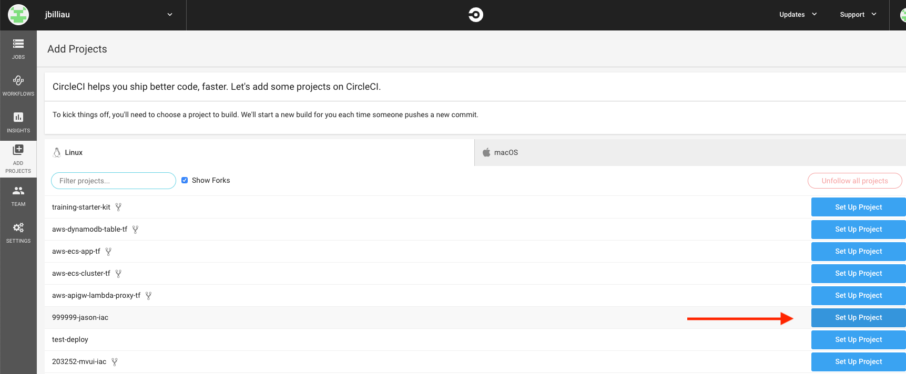
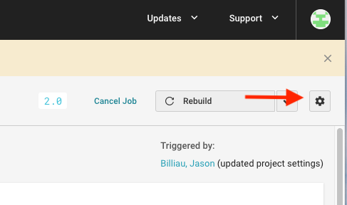
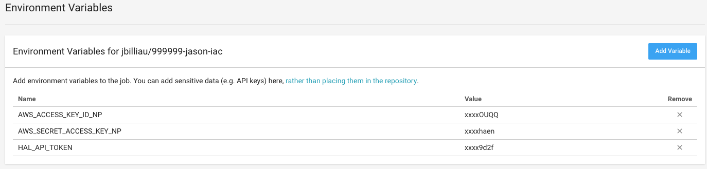

## Setting up HAL

1. Add your application to HAL
    - Fill out the dialog boxes with the relevant information:
        * Name: Name of your application
        * Organization: Organization (AWS Account) that you will be deploying to ( IAC Training for this class)
        * GitHub Repository: Link to the Git repo hosting your code and Dockerfile ( https://git.rockfin.com/YOURNAMNE/99999-YOURNAME-IAC )
        * Provider: AWS
        * Platform: Linux
        * Language: .NET Core
        * Click on `Show Advanced Options` and for **Multi-Solution Project**, put in `sample-container`. This will tell HAL to go into that subfolder once it hits your repo, since that is where our code, Dockerfile, and app-specific .hal9000.yml file lives. The root of your repo is where your IAC lives (Terraform).

2. Add deployment configuration
    - Select **Manually configure your environments** to add configuration. Deployment config is required for each environment.
    - Select your environment (`test-aws`)
    - Select `script` for **Server**.
    - Enter your application name for the **Name** (Or whatever you like, its up to you).
    - Enter the region for **Script Context** (us-east-2 in our example)
    - Select your AWS credentials for **Credentials** ( Choose "IAC Training - NonProd" for our example)
    - Click **Add Deployment**
    - Repeat above steps for beta and make another deployment target for **beta-aws**, entering the same information for every field.

## Setting up CI/CD

#### Configuring HAL

- Generate an access token that you will plug into CircleCI so that it can call HAL :key:
  * On the [hal settings page](https://hal9000/settings) create a personal access token.
  * For Token Type, select "Builds or Non-prod deployments". Copy this key and keep it handy, you'll need it for CircleCI below.

- In your **.hal9000.yml** file, replace the following values:
  * `HAL_ECS_CLUSTER` should reflect the ECS cluster name, for example : `test-ecscluster-418023852230-us-east-2`
  * `HAL_ECS_TASK` should reflect the name of your service in the ECS cluster. for example : `test-999999-YOURNAME`
  * `HAL_IMAGE_URL` should reflect your ECR URL, for example : `418023852230.dkr.ecr.us-east-2.amazonaws.com/test-999999-YOURNAME:${HAL_COMMIT}`
  * `HAL_TASK_ARN` should reflect your ECS task IAM role arn, for example: `arn:aws:iam::418023852230:role/QL/ECS/role-test-999999-YOURNAME`

#### Configuring CircleCI

- To setup your repo for CI/CD with CircleCI, first log into [CircleCI](https://circleci.foc.zone/)
  * Make sure you have CircleCI setup to point to your personal org/profile in the top left. Then, click `Add Projects` on the left hand side and click **Set Up Project** for your repo.
  

  </img>

   * On the next screen, click **Start building** at the very bottom. No need to click anything else.
   * On the next screen, click the gear icon in the top right.

  

  </img>

  * Go to the `Environment Variables` section and add a variable called `HAL_API_TOKEN` with the value of the token you just generated in the HAL step above. This allows CircleCI to talk to HAL.
  * Also, populate the IAM keys for the AWS account you are deploying to; this allows CircleCI to push docker images to ECR.

  

  </img>

- In your **.circleci/config.yml** file, replace the following values with your own:
  * `CIRCLE_DOCKER_IMAGE_NAME` should reflect your application name, for example : `YOURNAME`
  * `CIRCLE_AWS_REGION` should reflect the AWS region you are in : `us-east-2`
  * `CIRCLE_TEST_ECR_URL` should reflect your ECR URL  : `418023852230.dkr.ecr.us-east-2.amazonaws.com/test-999999-YOURNAME`
  * `CIRCLE_BETA_ECR_URL` should reflect your ECR URL  : `418023852230.dkr.ecr.us-east-2.amazonaws.com/beta-999999-YOURNAME`

  * `HAL_APP_ID: 'XXXX'` (retrieve via the URL when you click your APP in HAL. For example, for https://hal9000.rockfin.com/applications/1881/status, the APP_ID is 1881 )
  * `HAL_TARGETS: "XXXX"` (retrieve by clicking on your deployment target, it's the **Deployment ID**. Need two, one for test and beta)

